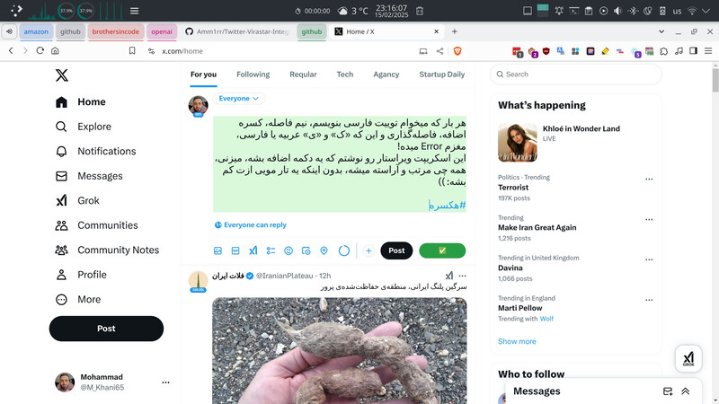
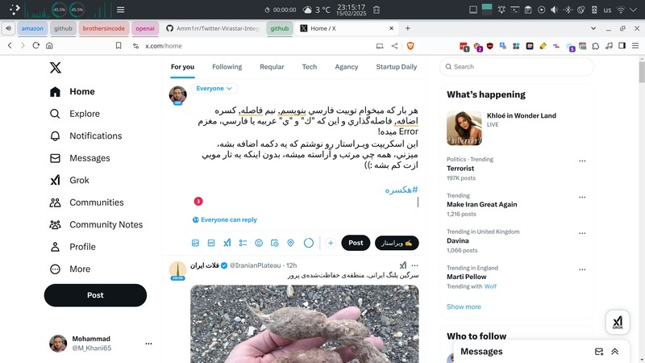
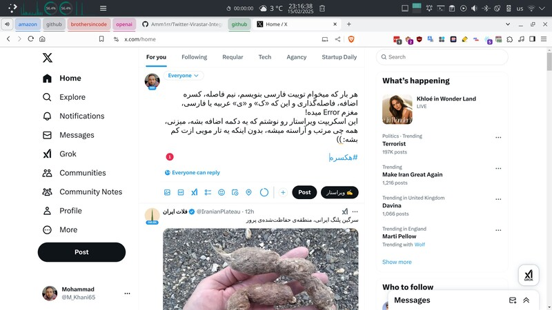

# ادغام ویراستار فارسی با توییتر ✨

این اسکریپت با افزودن دکمه ویراستار هوشمند به محیط توییتر، تجربه نوشتاری فارسی را متحول میکند! متن خود را قبل از ارسال به صورت حرفهای ویرایش و استانداردسازی کنید.

## 🚀 قابلیتهای کلیدی

- تبدیل خودکار نویسه‌های عربی به فارسی (کاف و یای فارسی)
- اصلاح فاصله‌گذاری حرفهای بین کلمات و علائم
- تبدیل اعداد انگلیسی/عربی به فارسی (۱۲۳ → ۱۲۳)
- حذف علائم نگارشی تکراری (!!؟؟ → !؟)
- اصلاح کاماهای انگلیسی به ویرگول فارسی
- استانداردسازی علائم ریاضی (+, -، ×، ÷)

## 📥 نصب در ۳۰ ثانیه!

1. **نصب افزونه مدیریت اسکریپت** (انتخاب من Violentmonkey):

   - [Chrome](https://chrome.google.com/webstore/detail/violentmonkey/jinjaccalgkegednnccohejagnlnfdag)
   - [Firefox](https://addons.mozilla.org/firefox/addon/violentmonkey/)
   - [Edge](https://microsoftedge.microsoft.com/addons/detail/violentmonkey/eeagobfjdenkkddmbclomhiblgggliao)

   - **Tampermonkey:** [Install for Safari](https://apps.apple.com/us/app/tampermonkey/id1482490089) | [Install for Opera](https://addons.opera.com/en-gb/extensions/details/tampermonkey-beta/)
   - **Userscripts:** [Install for Safari (iOS)](https://apps.apple.com/us/app/userscripts/id1463298887)

2. **نصب اسکریپت ویراستار**:
   - کلیک روی لینک نصب:  
     [📥 Twitter-Virastar-Integration.user.js](https://github.com/Amm1rr/Twitter-Virastar-Integration/raw/main/Twitter-Virastar.user.js)

## 🎮 راهنمای استفاده

1. وارد سایت توییتر شوید
2. روی فیلد نوشتن توییت کلیک کنید
3. دکمه جدید 🖋 **ویراستار** را در نوار ابزار انتخاب کنید
4. متن ویرایش شده را بررسی و ارسال کنید!

## 🔍 مقایسه قبل و بعد

| قبل از ویرایش                                             | بعد از ویرایش                                                 |
| --------------------------------------------------------- | ------------------------------------------------------------- |
|  |  |

## 📚 فناوری به کار رفته

- پشتیبانی از آخرین استانداردهای نگارش فارسی
- بهینه‌سازی شده برای نسخه‌های جدید توییتر

## 🙌 مشارکت و توسعه

- گزارشِ مشکلات و پیشنهادات:  
  [🎯 Issues Section](https://github.com/Amm1rr/Twitter-Virastar-Integration/issues)

- **کتابخانه Virastar**: با تشکر از [Zoghal](https://github.com/zoghal) برای بروزرسانی این کتابخانه قدرتمند ([مشاهده مستندات](https://github.com/zoghal/virastar/))

## 📜 مجوز

MIT License - استفاده آزاد با ذکر منبع مجاز است  
© 2025 [Amm1rr.com](https://amm1rr.com) - ساخته شده با ❤️ برای جامعه فارسی زبان
