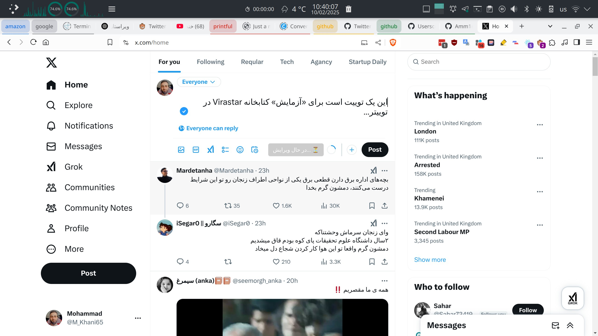

# ادغام ویراستار فارسی با توییتر ✨

اگر شما توییت‌های فارسی می‌نویسید و می‌خواهید سریع و راحت کیفیت نگارش خود را بالا ببرید، این اسکریپت دقیقاً همان چیزی است که نیاز دارید. به‌محض نوشتن یک توییت جدید (یا پاسخ‌دادن به توییتی)، دکمه‌ای به نام «ویراستار» دیده می‌شود که کلیک بر آن تمام ریزه‌کاری‌های نگارشی را درست می‌کند؛ از تصحیح فاصله‌گذاری و نیم‌فاصله تا یکدست‌کردن حروف عربی و فارسی. بدون هیچ دردسر اضافه، متن شما حرفه‌ای و استاندارد خواهد شد، درست مثل اینکه یک ویراستار انسانی روی توییت شما کار کرده باشد.

---

## 🌟 ویژگی‌های برجسته

### ویرایش هوشمند متن

- **تبدیل نویسه‌های عربی به فارسی** (ک، ی)
- **اصلاح فاصله‌گذاری و نیم‌فاصله** در ترکیبات: (می‌روم، خانه‌ها)
- **استانداردسازی علائم نگارشی** (ویرگول فارسی، گیومه‌ی « »)
- **بهینه‌سازی اعداد** (۱۲۳ ← ۱۲۳) و نمادهای ریاضی (× ÷)

### بهبود ساختار نوشتار

- **حذف علائم تکراری** (!!! → !)
- **اصلاح نشانه‌های منفی** (-- → –، --- → —)
- **تبدیل سه‌نقطه انگلیسی** به شکل استاندارد (…)
- **مدیریت صحیح کسره‌ی اضافه** (خانهٔ پدری)

---

## 🛠️ راه‌اندازی سریع

### پیش‌نیازها

- **مدیر اسکریپت** (Userscript Manager) نظیر:

| افزونه                                                                | پلتفرم‌های پشتیبانی‌شده                                                                                                                                                                                                                                                                                                                                             |
| --------------------------------------------------------------------- | ------------------------------------------------------------------------------------------------------------------------------------------------------------------------------------------------------------------------------------------------------------------------------------------------------------------------------------------------------------------- |
| **[Violentmonkey](https://violentmonkey.github.io/)** _(Recommended)_ |                                                                                                                                           |
| [Tampermonkey](https://www.tampermonkey.net/)                         |      |
| [Userscripts](https://apps.apple.com/us/app/userscripts/id1463298887) |                                                                                                                                                                                                                                                                                                        |

### مراحل نصب

1. **کلیک روی لینک** نصب اسکریپت:  
   [📥 دریافت آخرین نسخه](https://github.com/Amm1rr/Twitter-Virastar-Integration/raw/main/Twitter-Virastar.user.js)
2. **تأیید نصب** در افزونه‌ی مدیریت اسکریپت
3. **بارگذاری مجدد** صفحه‌ی توییتر

---

## 🎮 راهنمای عملیاتی

1. ورود به توییتر (X)
2. کلیک روی فیلد ایجاد توییت جدید یا بخش ریپلای
3. در نوار ابزار کنار دکمه‌ی «Tweet» یا «Reply»، آیکون/دکمه‌ی 🖋 **ویراستار** را مشاهده می‌کنید
4. پس از نوشتن متن فارسی، روی ویراستار کلیک کنید تا اصلاحات لازم اعمال شود
5. متن تمیزشده را بازبینی و در صورت تأیید، توییت را ارسال نمایید

---

## 📊 مقایسه تطبیقی

| وضعیت اولیه                                                | نتیجه‌ی ویرایش                                               |
| ---------------------------------------------------------- | ------------------------------------------------------------ |
|  |  |

---

## 🧠 معماری فنی و دلایل انتخاب روش

اسکریپت با ساختار داخلی توییتر کاملاً سازگار است. در اینجا چند نکته‌ی فنی ذکر می‌شود تا اگر توسعه‌دهنده‌ای علاقه به مشارکت داشت، به‌راحتی بداند چرا و چگونه این روش کار می‌کند:

1. **چالش Draft.js**

   - توییتر از Draft.js استفاده می‌کند. دستکاری مستقیم در فیلد متن می‌تواند کلیدهای Backspace و Delete را مختل سازد.
   - **راهکار**: رویکرد `ClipboardEvent` و قرار دادن متن در `DataTransfer`، سپس ارسال رویداد Paste. این روش State داخلی React را به هم نمی‌ریزد.

2. **MutationObserver**

   - برای پرهیز از کندی یا هنگ، تمام سند را به شکل دائم جست‌وجو نمی‌کنیم؛ فقط اضافه‌شدن گره‌های جدید (childList) را نظارت کرده و اگر دکمه‌ی جدید Tweet/Reply ظاهر شد، به آن دکمه‌ی ویراستار اضافه می‌کنیم.

3. **مدیریت چند دکمه‌ی توییتر**

   - وقتی یک دیالوگ باز می‌شود و دکمه‌ی جدیدی در صفحه پدیدار می‌گردد، دکمه‌ی پیشین بررسی می‌شود؛ اگر در DOM نباشد، ویراستار قدیمی حذف می‌شود. در نتیجه مانع تکرار و انباشت دکمه‌های بی‌مصرف می‌شویم.

4. **سفارشی‌سازی برای متن فارسی**
   - اگر متن با حروف فارسی شروع شود، فیلد به صورت `rtl` نمایش داده می‌شود.
   - کتابخانه‌ی ویراستار اصلاحات رایج نوشتاری (نیم‌فاصله، حروف عربی/فارسی، کسره‌ی اضافه، علائم نگارشی و...) را اعمال می‌کند.

---

## 🙏 سپاس از کتابخانه ویراستار

- [Virastar](https://github.com/brothersincode/virastar) - ویراستارِ متنِ فارسی

---

## 🤝 مشارکت در توسعه

### گزارش مشکلات

- ایجاد Issue جدید در [سیستم پیگیری مشکلات](https://github.com/Amm1rr/Twitter-Virastar-Integration/issues)
- ارائه نمونه کد/تصویر خطا و گام‌های بازتولید

---

## 📄 مجوز استفاده

این پروژه تحت مجوز **[MIT License](https://opensource.org/licenses/MIT)** منتشر شده است.

- هیچ وابستگی رسمی به توییتر (X) ندارد.
- مسئولیت استفاده و هرگونه عواقب احتمالی بر عهده‌ی کاربر است.

توسعه داده شده با [❤️](https://amm1rr.com) برای زبانِ فارسی

---

